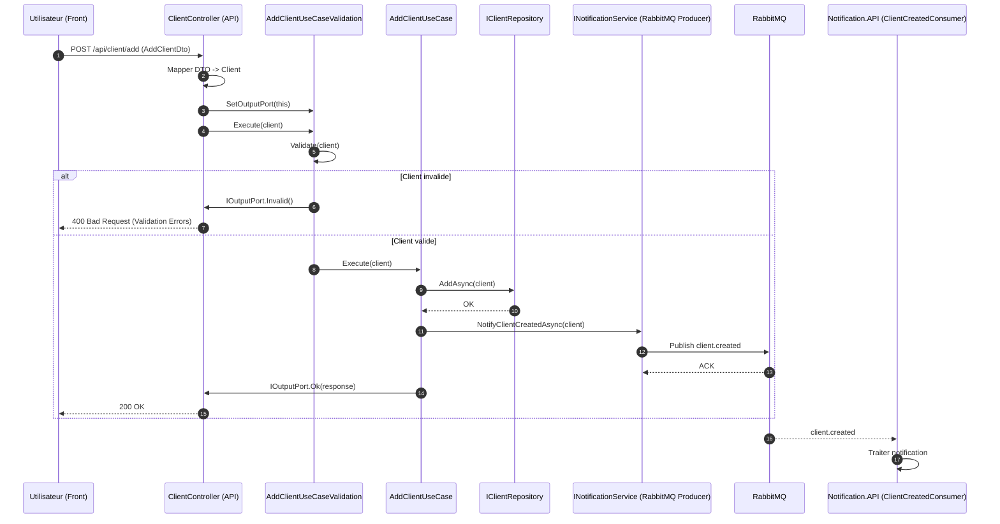

# ClientSolution


ClientSolution is a Clean / Hexagonal .NET project that demonstrates a
well-structured architecture for building a scalable and maintainable
API.\
The current focus is on the **AddClient use case**, with clear
separation of concerns between layers.

------------------------------------------------------------------------

## 🧱 Project Structure

    ClientSolution
    │
    ├── ClientSi.DOMAIN
    ├── ClientSi.APPLICATION
    ├── ClientSi.INFRASTRUCTURE
    └── ClientSi.API

### 📌 Layers Overview

  ------------------------------------------------------------------------
  Layer                Responsibility
  -------------------- ---------------------------------------------------
  **Domain**           Business entities, rules and core interfaces

  **Application**      Use cases, business orchestration, validation

  **Infrastructure**   External technical concerns (DB, EF Core,
                       messaging, etc.)

  **API**              REST endpoints, DTOs, presentation adapters
  ------------------------------------------------------------------------

------------------------------------------------------------------------


## 🧠 Architectural Principles

This project follows **Clean / Hexagonal Architecture**:

-   **Domain** is pure and independent of frameworks.
-   **Application** contains use case logic and validation.
-   **Infrastructure** implements technical details like persistence.
-   **API** maps DTOs, calls use cases, and returns HTTP results.

Dependencies always flow inward:

    ClientSi.API → ClientSi.APPLICATION → ClientSi.DOMAIN
                            ↑
                    ClientSi.INFRASTRUCTURE

------------------------------------------------------------------------

## 🚀 Add Client Use Case

This API supports adding a new client via:

    POST /api/AddClient/ajouter

### Example Request

``` json
{
  "nom": "Dupont",
  "prenom": "Jean",
  "typologie": "FOURNISSEUR"
}
```

### Expected Responses

-   **200 OK** -- on success
-   **400 Bad Request** -- on validation failure

------------------------------------------------------------------------

## 🛠 Setting Up

### ⚙️ Prerequisites

-   .NET 6.0 or later
-   SQL Server (local or remote)

------------------------------------------------------------------------

## 📦 Database Setup

Add your connection string to `ClientSi.API/appsettings.json`:

``` json
{
  "ConnectionStrings": {
    "ClientDb": "Server=(localdb)\\MSSQLLocalDB;Database=ClientDb;Trusted_Connection=True;TrustServerCertificate=True;"
  }
}
```

Register your DbContext in `Program.cs`.

------------------------------------------------------------------------

## 🗺 Dependency Registration

Dependencies are configured in the API startup to inject:

-   Repository implementations
-   Use cases
-   Validation decorators
-   AutoMapper
-   DbContext

------------------------------------------------------------------------

## 🧪 Running Migrations

Run EF Core migrations from Infrastructure with API as startup project.

------------------------------------------------------------------------

## 🚀 Testing

You can import a Postman collection to test the AddClient endpoint.

------------------------------------------------------------------------

## 📈 Design Goals

-   Maintainability\
-   Strict separation of responsibilities\
-   No framework leakage into Domain\
-   Easy extension (e.g., UpdateClient, RabbitMQ integration)

------------------------------------------------------------------------

## 📅 Roadmap

-   ✔ AddClient
-   ⏳ UpdateClient
-   📤 RabbitMQ event publishing
-   🔐 Authentication / Authorization
-   📊 Unit & integration tests

------------------------------------------------------------------------

## 🤝 Contributing

Feel free to open issues or submit pull requests.

------------------------------------------------------------------------

## 📝 License

This repository is open-source under the MIT License.
